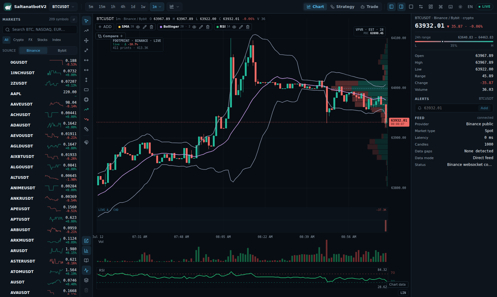
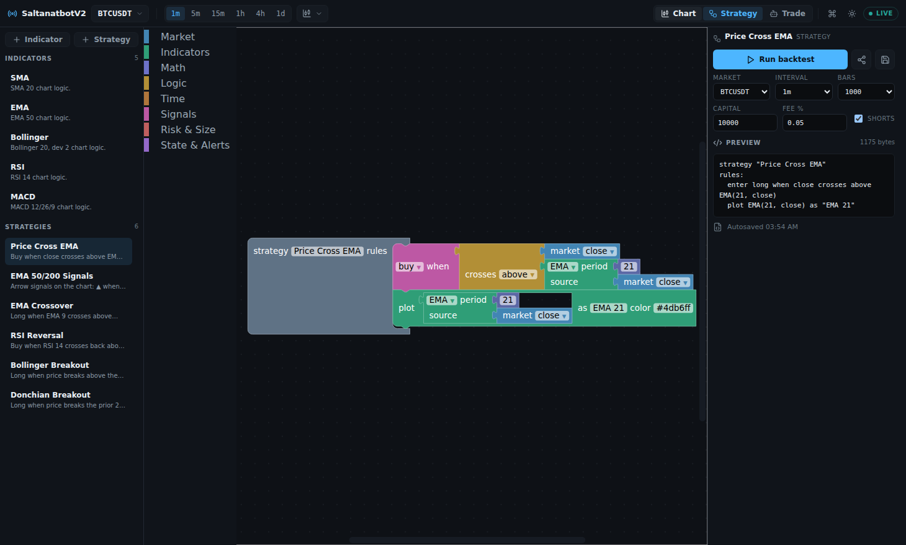

<div align="center">

**English** · [Русский](README.ru.md) · [Қазақша](README.kk.md)


# SaltanatbotV2 🐘

**A self-hosted, open-source crypto trading terminal.**
Live charts · a no-code visual strategy builder · one-click backtests · paper & live trading.

[](https://github.com/AubakirovArman/SaltanatbotV2/actions/workflows/ci.yml)
[](LICENSE)
[](https://nodejs.org)
[](https://www.typescriptlang.org)
[](https://react.dev)
[](https://vite.dev)
[](CONTRIBUTING.md)

</div>

---

## What is this?

**SaltanatbotV2** is a trading terminal you run yourself. It streams live crypto candles from **Binance or Bybit** (switchable at runtime), renders them on a fast custom canvas chart with indicators and drawing tools, lets you **assemble trading strategies from visual blocks** (no code), **backtest them on historical data in seconds**, and then run them as **paper or live bots** driven by a compact Antares-style command language — with **Telegram / VK** notifications.

Everything is local: your keys, your data, your rules. There is no account, no cloud, no telemetry.

> 🐘 *Why the elephant with a raised trunk?* A raised trunk is the classic symbol of good fortune — and the candlesticks rising over its back point the way we all hope the market goes.

<div align="center">

<br/><em>Chart workspace — 50+ crypto pairs, a Binance/Bybit source selector, indicators, volume, RSI sub-panel and a live websocket feed.</em>
</div>

---

## Features

### 📈 Charting
- Custom **canvas chart engine** (no heavy chart library) with its own viewport / time-scale coordinate system.
- Chart types: **candles, hollow candles, Heikin-Ashi, bars, line, step line, area, baseline, Renko, Three Line Break, Kagi and Point & Figure**. Ten timeframes from **1m to 1M**.
- Stable close-only Renko uses fixed 0.05%-seeded bricks, a true two-brick reversal, aggregated source volume and actual discarded-close wicks; live tails never rewrite confirmed bricks.
- Confirmed close-only Kagi uses a fixed 0.10%-seeded reversal to filter noise into continuous up/down legs with shoulder and waist turns; the provisional live tail is excluded.
- Renko brick percentage, Kagi reversal percentage and Line Break depth are adjustable from the chart, validated to safe ranges and persisted locally; changing them rebuilds the full shared display series without changing backtest execution candles.
- Point & Figure uses alternating confirmed X/O columns with a fixed seeded percentage box and configurable reversal-box count; its synthetic columns are display analysis, not executable prices.
- OHLCV-estimated visible-range Volume Profile (VPVR) with directional volume, Point of Control and a contiguous 70% value area.
- Real Binance/Bybit public top-20 order-book heatmap with a shared backend upstream, 60-second liquidity history and explicit reconnect/stale states.
- Real-time Binance/Bybit trade footprint with aggressor cells, delta/CVD, diagonal and stacked imbalance highlighting, and explicitly provisional absorption heuristics; no synthetic prints or reconstructed history.
- Configurable in-chart microstructure alerts for stacked imbalance, potential absorption, CVD spikes and large prints, with local persistence, bounded history and optional sound/desktop delivery.
- UTC session-liquidity map with OHLCV bar-based VWAP ±1σ, session O/H/L, exchange daily PDH/PDL and confirmed wick-and-reclaim sweep markers.
- Confirmed HH/LH/HL/LL market structure with close-based BOS/CHOCH, adjustable swing strength and optional fully mitigated three-candle FVG zones on every timeframe.
- One-click Anchored VWAP drawings with editable/persisted anchors, a ±1σ value area, ±1σ/±2σ bands and a semantic current-value legend.
- DST-aware Asia, London and New York session high/low boxes with independent accessible toggles on precise intraday charts.
- Indicators: **SMA, EMA, Bollinger, RSI, MACD, VWAP, ATR, Stochastic, OBV** and arrow **signal** overlays (e.g. EMA crossovers).
- **Price alerts** (browser notification + sound), **symbol compare** overlay, crosshair with OHLC legend, persistent drawing tools, a zero-persistence **Shift-drag ruler** for price/%/bars/time, and **lazy-loaded history** on scroll-back.
- Independent right-axis price scaling supports wheel/trackpad, vertical drag, keyboard arrows, `Home` and double-click reset without changing the visible candle range.
- Retina/HiDPI Canvas backing keeps candles, axes, footprint and depth crisp without changing mouse, trackpad or HUD geometry.
- One-, two- and four-chart layouts have direct numbered pane selectors, an explicit numbered active badge, customizable `Alt+J` / `Alt+K` keyboard cycling, adaptive compact chrome and a state-preserving active-pane maximize mode. The top bar, command palette, watchlist, live statistics and timeframe shortcuts follow the focused pane; drawings are always isolated by pane and symbol, while secondary symbols, timeframes, indicator sets and compare overlays become independent when edited and can explicitly relink comparisons, indicators, symbol, timeframe, crosshair and the absolute visible **time range**. Identical pane market keys share one ref-counted browser WebSocket.
- Watchlist with **favorites** and **%-change sorting**; automatic last-session recovery plus **saved workspaces** for named/versioned layouts; overlay a saved strategy directly on the chart with its **plotted indicator lines**, **buy/sell signal points** and simulated trades.

### 🧱 Visual strategy builder + backtester
- **Blockly** no-code builder — snap together Market / Indicators / Math / Logic / Time / Signals / Risk & Size / State & Alerts blocks. Start from a **template gallery**.
- Blocks compile to a safe **JSON intermediate representation (IR)** — **no `eval`, ever**.
- **Trustworthy backtests**: next-bar-open fills, gap-aware stops, slippage/funding costs, warm-up exclusion, Monte Carlo robustness, drawdown/MAE-MFE, and a **parameter optimizer with walk-forward** (in-/out-of-sample, Web Worker).
- Metrics + trade markers on the chart; share a strategy as a **URL** or a **`.strategy` file** (import as a remixable copy).

### 🤖 Paper & live trading
- Run any saved strategy as a bot in **paper** (default), **Binance**, or **Bybit** mode.
- Strategy signals are translated into an **Antares-style command language**: `param=value;` params, `::` command chaining, `pause` / `randpause`, `!`/`^` flags and **14 order actions** (market/limit/stop/take-profit, partial closes, reverses, and more).
- Built-in **paper order engine** with pending limit/stop/TP orders and tick-based fills at real market prices; live orders round to exchange filters and place **exchange-side protective stops**.
- **Cross-bot portfolio view**, per-bot risk caps + a **kill switch**, and **two-way Telegram control** (`/status` `/stop` `/start` `/kill`).
- **Telegram & VK** notifications on start/stop/open/close/error/signal.

### 🔀 Multi-exchange market data
- **Binance** and **Bybit** public providers (REST klines + live WebSocket) with **auto-reconnect + gap backfill**, plus a deterministic **synthetic** feed for FX/stocks/indices.
- **~200 USDT-spot pairs** discovered dynamically from the exchanges (curated fallback), a **persistent SQLite candle store** for deep history, and rate-limit-aware fetching.
- Pick the crypto **data source** (Binance ⇄ Bybit) right in the Markets panel — the whole chart, sparklines and stream re-point instantly.

### 🔒 Local-first & secure
- Exchange API keys are **encrypted at rest** with AES-256-GCM (`node:crypto`) — they are **never** sent back to the browser and never leave your machine.
- Persistence uses Node's **built-in** `node:sqlite` — no native builds, no external database, no occupied ports.

---

<div align="center">

<br/><em>Strategy Lab — build from blocks on the left, watch it compile to readable rules on the right, then backtest.</em>
</div>

---

## Tech stack

| Layer | Stack |
| --- | --- |
| **Frontend** | React 18 · Vite 8 · TypeScript · Blockly · a custom canvas chart engine · `lucide-react` |
| **Backend** | Node 24 · Express 5 · `ws` (WebSocket) · `zod` · built-in `node:sqlite` & `node:crypto` |
| **Market data** | Binance & Bybit public REST + WebSocket · synthetic generator |
| **Tooling** | npm workspaces monorepo · TypeScript ESM (NodeNext) · Playwright |

---

## Quick start

**Prerequisites:** [Node.js **24+**](https://nodejs.org) and npm.

```bash
# 1. Clone
git clone https://github.com/AubakirovArman/SaltanatbotV2.git
cd SaltanatbotV2

# 2. Install all application and shared workspaces
npm install

# 3a. Develop — backend (tsx watch) + frontend (Vite) with hot reload
npm run dev
#    frontend → http://localhost:4180   backend/API → http://localhost:4181

# 3b. …or build & run production (backend serves the built frontend on one port)
npm run build
npm start
#    open → http://localhost:4180
```

Configure the host/port/token with environment variables (defaults shown):

```bash
PORT=4180 HOST=127.0.0.1 npm start        # loopback by default; set HOST=0.0.0.0 to expose
```

> **First run creates `backend/data/`** — an AES key (`.secret`), an access token (`.authtoken`),
> and a SQLite database (`trading.db`). The backend **prints the access token** on first start; you
> enter it once to unlock the Trade tab (or set your own via `AUTH_TOKEN`). All of `backend/data/` is
> **git-ignored** and must never be committed. For a paper-only public demo, run with `DEMO_MODE=1`.
> See [docs/CONFIGURATION.md](docs/CONFIGURATION.md).

### …or with Docker

```bash
# Builds the application workspaces and runs the backend (which serves the SPA) on :4180.
# backend/data (DB + secrets) is a persistent named volume.
docker compose up --build          # open → http://localhost:4180
```

The access token is printed in the container logs (`docker compose logs`), or set `AUTH_TOKEN` in your environment first. Pass `DEMO_MODE=1` for a paper-only public demo.

**Tests & CI:** `npm test` (Vitest — command parser, paper engine, backtest honesty, evaluator parity) and `npm run lint` / `npm run check` run in [CI](.github/workflows/ci.yml) on every push. Authenticated exchange release checks are isolated in the manually dispatched, protected [testnet smoke workflow](.github/workflows/exchange-testnet-smoke.yml).

---

## Documentation

Public multilingual overview: **GitHub Pages** (English · Русский · Қазақша). The deployment URL is
published by the `Deploy documentation site` workflow and is also set as the repository homepage.

| Guide | What's inside |
| --- | --- |
| [**Architecture**](docs/ARCHITECTURE.md) | Monorepo layout, backend/frontend tiers, the provider router, the shared strategy IR, end-to-end data flow |
| [**API reference**](docs/API.md) | Every REST endpoint and WebSocket message — params, types, and `curl` examples |
| [**Generated endpoint index**](docs/API_ENDPOINTS.generated.md) | Route-presence and access-level index generated from Express sources |
| [**Strategies & backtesting**](docs/STRATEGIES.md) | Building from blocks, the IR, `runBacktest` / `previewStrategy`, sharing, and live parity |
| [**Generated block catalog**](docs/BLOCK_CATALOG.generated.md) | Stable Blockly type identifiers and canonical trader-facing help generated from metadata |
| [**Generated Pine compatibility**](docs/PINE_COMPATIBILITY.generated.md) | Corpus-backed exact, display-only, approximation and rejected feature matrix |
| [**Trading & command language**](docs/TRADING.md) | The Trade tab, all 14 Antares-style actions, paper/Binance/Bybit modes, notifications |
| [**Configuration & deployment**](docs/CONFIGURATION.md) | Env vars, runtime data, exchange keys, encryption, production & hardening checklist |
| [**Backup & restore**](docs/BACKUP_RESTORE.md) | Verified online SQLite snapshots, checksums, atomic restore and recovery drills |
| [**Release policy & verification**](docs/RELEASING.md) | Nightly/alpha/beta/stable channels, SBOM, SHA-256 and Sigstore attestation verification |
| [**Roadmap**](docs/ROADMAP.md) | What has shipped and what's next |
| [**Master improvement plan**](docs/MASTER_IMPROVEMENT_PLAN.md) | Product gaps, priorities, release gates and delivery milestones |
| [**Implementation status**](docs/IMPLEMENTATION_STATUS.md) | Completed commits, verification evidence, active work and remaining checklist |
| [**Modular architecture**](docs/MODULAR_ARCHITECTURE.md) | Target packages, module boundaries and safe decomposition sequence |
| [**Testing strategy**](docs/TESTING_STRATEGY.md) | Unit, parity, browser E2E, visual, accessibility, performance and recovery testing |
| [**Internationalization & docs**](docs/I18N_AND_DOCUMENTATION.md) | English/Russian structure, UI i18n and documentation quality gates |
| [**Documentation status**](docs/DOCUMENTATION_STATUS.md) | Currency audit, ownership, verification dates and EN/RU/KK user-guide coverage |
| [**Russian user guide**](docs/ru/README.md) | Chart, Strategy Studio, Pine/backtest, trading, traces and safety in Russian |
| [**Kazakh user guide**](docs/kk/README.md) | Chart, Strategy Studio, Pine/backtest, trading, traces and safety in Kazakh |
| [**Contributing**](CONTRIBUTING.md) | Dev setup, repo conventions, and how to add instruments / blocks / commands |
| [**Security policy**](SECURITY.md) | Private vulnerability reporting, supported versions and secret-handling rules |
| [**Threat model**](docs/THREAT_MODEL.md) | Assets, trust boundaries, threats, mitigations, non-goals and residual risks |
| [**Support**](SUPPORT.md) | How to request help or file a reproducible issue safely |
| [**Code of conduct**](CODE_OF_CONDUCT.md) | Community participation and moderation expectations |
| [**Changelog**](CHANGELOG.md) | User-visible changes grouped by release |

---

## Project structure

```text
SaltanatbotV2/
├── backend/                 # @saltanatbotv2/backend — Express + ws + node:sqlite
│   └── src/
│       ├── server.ts        # HTTP + WebSocket on one port, static SPA hosting
│       ├── market/          # instrument catalog + timeframe/interval maps
│       ├── providers/       # binance · bybit · synthetic · router · cache
│       └── trading/         # command parser, engine, exchange adapters, strategy runtime
├── frontend/                # @saltanatbotv2/frontend — React + Vite
│   └── src/
│       ├── chart/           # canvas chart engine + renderers + objects
│       ├── strategy/        # Blockly builder, IR compiler, backtest
│       ├── trading/         # Trade tab UI
│       ├── components/  hooks/  api/  styles/
│       └── App.tsx
├── packages/                # contracts, Pine, strategy, execution, backtest and test-fixture cores
├── docs/                    # architecture, API, trading, strategies, configuration
└── assets/                  # logo
```

---

## Security & responsible use

- **The trading API requires an access token.** On first run the backend prints an admin token (also saved to `backend/data/.authtoken`, or set your own with `AUTH_TOKEN`) — you enter it once to unlock the **Trade** tab. The browser exchanges it for an HttpOnly session cookie, mutating trade requests use CSRF, and the trade socket uses one-time tickets. Optional scoped tokens (`AUTH_READONLY_TOKEN`, `AUTH_PAPER_TRADE_TOKEN`, `AUTH_LIVE_TRADE_TOKEN`) enable lower-privilege access. Mutating trade calls are audit-logged with secrets redacted. Public market-data/chart endpoints stay open. Foreign browser origins are blocked by a CORS allowlist.
- **Binds to `127.0.0.1` by default.** Set `HOST=0.0.0.0` deliberately, and only behind a **reverse proxy with TLS** + firewall. See the hardening checklist in [docs/CONFIGURATION.md](docs/CONFIGURATION.md).
- **Live trading is disarmed and double-confirmed.** Paper mode is the default; live orders need a global arm toggle **and** a per-bot confirmation, and there's a one-click **kill switch**. Run `DEMO_MODE=1` for a paper-only public demo. Per-bot caps (max notional, max daily loss) act as circuit breakers.
- **Your keys stay yours.** Exchange API keys are AES-256-GCM encrypted on disk and never returned to the browser. **Never commit `backend/data/`** (enforced by `.gitignore`) — it holds your encryption key, token, and database. Use trade-only keys without withdrawal permission.

> ⚠️ **Disclaimer.** SaltanatbotV2 is provided as-is for research and educational purposes. Trading cryptocurrencies carries substantial risk. Nothing here is financial advice — you are solely responsible for any orders placed with your keys. Test on paper first.

---

## Acknowledgements

- The block builder is powered by [**Blockly**](https://developers.google.com/blockly).
- The trading command syntax is inspired by the [**Antares**](https://antares-ts.gitbook.io/doc) command language.
- Market data comes from the public [Binance](https://binance-docs.github.io/apidocs/) and [Bybit](https://bybit-exchange.github.io/docs/) APIs.

## License

Released under the [MIT License](LICENSE).
